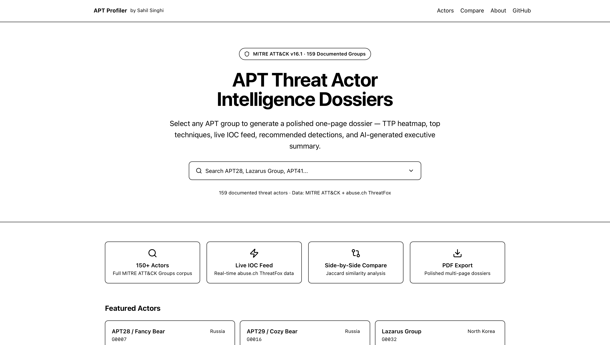
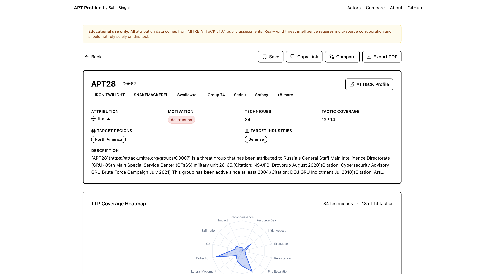
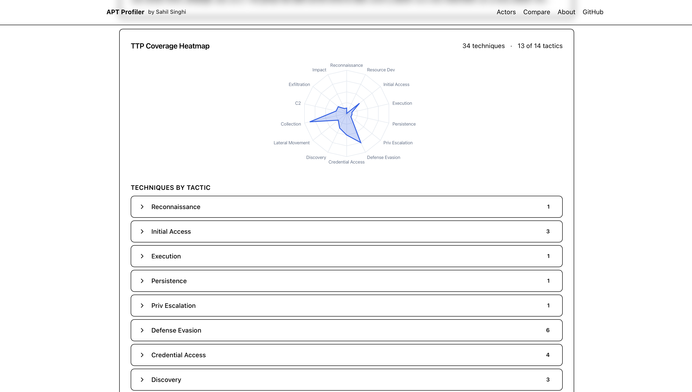
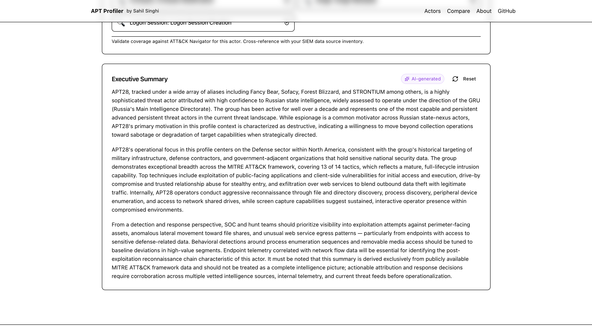
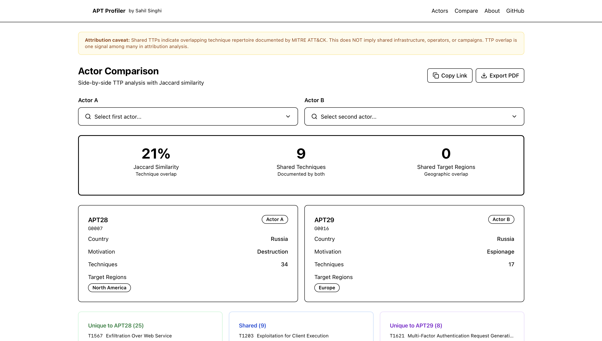

# APT Profiler

> Generate polished APT threat actor dossiers from the MITRE ATT&CK Groups corpus.

**Live demo:** https://apt-threat-actor-profiler.vercel.app

---

## Screenshots











---

## What It Does

APT Profiler turns the MITRE ATT&CK Groups corpus into shareable, comparable intelligence dossiers. Select any of 159 documented APT groups and get a one-page profile — instantly.

**Per-actor dossier includes:**
- Aliases, attributed country, and motivation (espionage / financial / hacktivism / destruction)
- Target regions and industries (extracted from ATT&CK descriptions)
- TTP coverage heatmap across all 14 MITRE ATT&CK tactics (Recharts radar chart)
- Top-10 techniques table with technique IDs, tactic mapping, and ATT&CK reference links
- Live IOC feed from abuse.ch ThreatFox (keyless API, graceful degradation)
- Recommended detection priorities derived from ATT&CK data-source mappings
- AI-generated 3-paragraph executive summary via Claude Sonnet 4.6 (falls back to templated summary)

**Comparison mode:**
- Side-by-side two-actor analysis
- Technique-level Jaccard similarity score
- Shared vs. unique techniques, target region overlap, target industry overlap
- Deep-linkable URL: `/compare?a=G0007&b=G0016`

**Export & share:**
- Multi-page PDF dossier (jsPDF + AutoTable)
- Save dossiers to localStorage for quick recall
- Deep-linkable actor URLs: `/actor/G0007` for APT28

---

## Tech Stack

| Layer | Tools |
|---|---|
| Framework | Next.js 14 App Router, TypeScript strict |
| Styling | Tailwind CSS + shadcn/ui |
| Charts | Recharts (radar) |
| PDF | jsPDF + jsPDF-AutoTable |
| Data | MITRE ATT&CK STIX v16.1 (vendored) + abuse.ch ThreatFox |
| AI | Anthropic Claude Sonnet 4.6 (optional) |
| Hosting | Vercel |

---

## Data Sources

### MITRE ATT&CK v16.1
- Source: [github.com/mitre/cti](https://github.com/mitre/cti)
- Bundle: vendored at `/data/mitre/enterprise-attack.json`
- Version: ATT&CK v16.1 — pinned for reproducibility
- Contains: 159 documented intrusion sets, 203 techniques, 21,315 STIX objects

### abuse.ch ThreatFox
- Endpoint: `https://threatfox-api.abuse.ch/api/v1/`
- No API key required
- IOCs fetched live client-side; cached 1 hour in browser memory

To update the MITRE bundle to a newer release:
```bash
curl -L "https://github.com/mitre/cti/raw/ATT%26CK-v17.0/enterprise-attack/enterprise-attack.json" \
  -o data/mitre/enterprise-attack.json
```
Then update `MITRE_VERSION` in `lib/types.ts`.

---

## Running Locally

```bash
git clone https://github.com/sahilsinghi/apt-threat-actor-profile
cd apt-threat-actor-profile
pnpm install --ignore-scripts
pnpm dev
```

Open [http://localhost:3000](http://localhost:3000).

**Optional AI summaries:**
```bash
# .env.local
ANTHROPIC_API_KEY=sk-ant-...
```

---

## Deploying to Vercel

```bash
vercel --prod
```

Add `ANTHROPIC_API_KEY` in Vercel Dashboard → Settings → Environment Variables.
The app works fully without the key (uses templated summaries).

---

## Methodology

See [docs/methodology.md](docs/methodology.md) for:
- How TTP coverage is computed from STIX relationships
- How Jaccard similarity is calculated for comparison
- How recommended detections are derived from ATT&CK data sources

See [docs/privacy-architecture.md](docs/privacy-architecture.md) for the privacy model.

---

## Part of Sahil's Security Engineering Portfolio

This project is designed to complement a SOAR alert triage pipeline:

```
SOAR Pipeline → enriches the indicator
APT Profiler  → maps the indicator to the likely threat actor
SOC Lab       → validates detections for that actor's known TTPs
```

**Related projects by Sahil Singhi:**
- [DPDP Compliance Tool](https://github.com/sahilsinghi/dpdp-compliance-tool) — India DPDP Act 2023 self-assessment

---

## Definition of Done

- [x] Live production URL on Vercel (actor dropdown shows 159 MITRE ATT&CK Groups)
- [x] MITRE ATT&CK STIX bundle vendored at `/data/mitre/` (ATT&CK v16.1)
- [x] TTP heatmap visualization for every actor
- [x] ThreatFox live integration with informative empty state
- [x] Side-by-side comparison mode with Jaccard similarity
- [x] PDF export (multi-page, client-side via jsPDF)
- [x] Deep-linkable URLs (`/actor/G0007`)
- [x] AI executive summary with templated fallback
- [ ] Lighthouse Performance > 90, Accessibility > 95
- [x] Hero screenshot added
- [x] Live URL added above

---

## Disclaimer

**Educational use only.** All attribution data comes from MITRE ATT&CK v16.1 public assessments.
This tool does not produce actionable threat intelligence.
Real-world threat intelligence requires multi-source corroboration by qualified analysts
and should not rely on a single public data source for attribution or response decisions.
